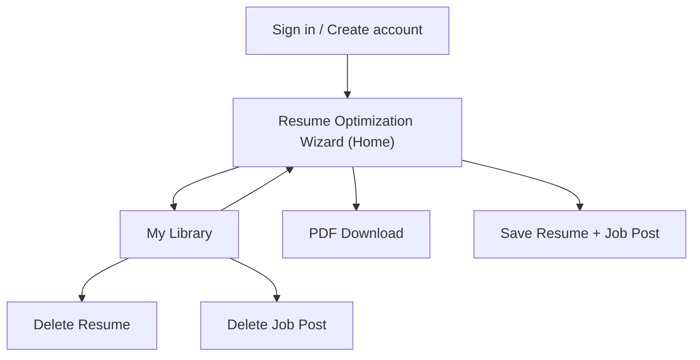

## 1. Product Overview
JobHunt AI is a resume optimization wizard that tailors your resume to a specific job posting using AI.
You can upload/write a resume, generate and edit improvements, download a PDF, and save/delete resumes and job posts per user.

Implementation target:
- Frontend: Next.js (App Router)
- Backend: FastAPI + LangChain/LangGraph using Gemini
- Persistence/Auth: Supabase (Postgres + Auth)

Target architecture:
- Frontend: Next.js (App Router) + Tailwind
- Backend: FastAPI + LangChain + LangGraph
- Auth/DB/Storage: Supabase (per-user RLS)
- LLM: Gemini API

## 2. Core Features

### 2.1 User Roles
| Role | Registration Method | Core Permissions |
|------|---------------------|------------------|
| Guest | None | Can view the app and is prompted to sign in before saving. |
| User | Email + password (Supabase Auth) | Can optimize resumes, download PDF, save/view/delete resumes and job posts. |

### 2.2 Feature Module
Our JobHunt AI requirements consist of the following main pages:
1. **Resume Optimization Wizard (Home)**: job post input, resume upload/create, AI optimization, in-app editing, PDF download, save.
2. **My Library**: saved resumes list, saved job posts list, open details, delete.
3. **Sign in / Create account**: email authentication, session handling, sign out.

### 2.3 Page Details
| Page Name | Module Name | Feature description |
|-----------|-------------|---------------------|
| Resume Optimization Wizard (Home) | Job post input | Capture job posting via paste text and/or URL field; validate required fields. |
| Resume Optimization Wizard (Home) | Resume input | Upload resume file (PDF/DOCX/TXT) and/or start from blank; show extracted text preview. |
| Resume Optimization Wizard (Home) | AI optimization | Generate optimized resume text based on job post + source resume; allow regenerate with same inputs. |
| Resume Optimization Wizard (Home) | Resume editor | Edit optimized resume with structured sections (e.g., Summary/Experience/Skills) and plain-text fallback; track unsaved changes. |
| Resume Optimization Wizard (Home) | Save & versioning (minimal) | Save the current optimized resume and its linked job post to your account; keep the latest optimized content per saved resume. |
| Resume Optimization Wizard (Home) | PDF download | Export the current edited resume to a downloadable PDF. |
| My Library | Saved resumes | List saved resumes (title, updated time); open a resume to view/edit and re-download PDF; delete with confirmation. |
| My Library | Saved job posts | List saved job posts (title/company); open to view full description; delete with confirmation. |
| My Library | Linking | Show which job post a resume was optimized for (if linked). |
| Sign in / Create account | Auth forms | Sign in, sign up, password reset request; show errors and loading states. |
| Sign in / Create account | Session controls | Persist session; sign out; redirect back to Wizard after sign-in. |

## 4. Non-Goals (Phase 1)
- Multi-job Kanban tracking
- Cover letter and interview coaching
- Multi-language resume generation
- Complex PDF templates (single clean template only)

## 5. Success Criteria
- You can paste a job post + upload a PDF resume, generate an optimized resume, edit it, and download a PDF.
- Signed-in users can save and later delete both job posts and resumes.
- Data is isolated per user via Supabase RLS.

## 3. Core Process
**Guest flow**: You open the Wizard, enter a job post and resume, and attempt to save; you are prompted to sign in.

**User flow**: You sign in → enter/paste job post → upload or create resume → run optimization → edit the result → download PDF → optionally save the resume + job post → manage saved items (open, re-download, delete) in My Library.

