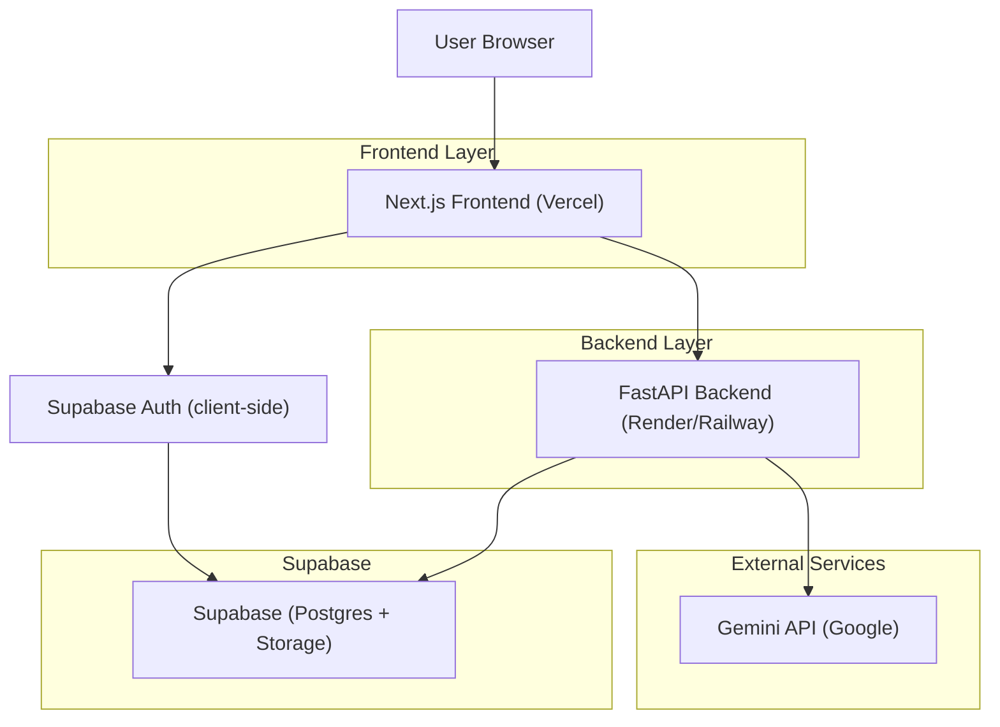
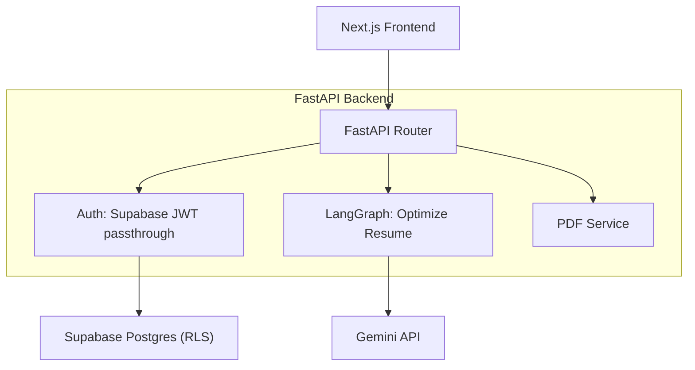
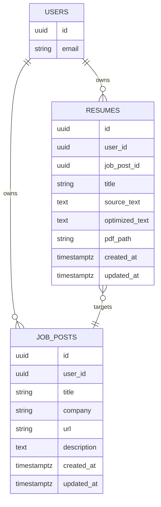

## 1.Architecture design


## 2.Technology Description
- Frontend: Next.js 14 (App Router) + React 18 + TypeScript + Tailwind
- Backend: FastAPI (Python 3.12+) + LangChain + LangGraph
- Database/Auth/Storage: Supabase (PostgreSQL + RLS, Auth, Storage)
- LLM: Gemini API via LangChain (API key stored on backend)

## 3.Route definitions
| Route | Purpose |
|-------|---------|
| / | Landing (CTA to start wizard) |
| /login | Sign in / sign up |
| /dashboard | Resume Optimization Wizard |
| /library | Saved resumes and job posts management (open, delete) |

## 4.API definitions (If it includes backend services)
### 4.1 Extract Job Posting from URL
```
POST /api/jobs/extract
```
Request:
| Param Name | Param Type | isRequired | Description |
|-----------|------------|------------|-------------|
| url | string | true | Job posting URL |

Response:
| Param Name | Param Type | Description |
|-----------|------------|-------------|
| title | string | Best-effort extracted title |
| company | string | Best-effort extracted company |
| description | string | Extracted readable job text |

### 4.2 Parse Resume PDF
```
POST /api/resumes/parse
```
Request: multipart form-data
| Field | Type | isRequired | Description |
|------|------|------------|-------------|
| file | file | true | PDF resume file |

Response:
| Param Name | Param Type | Description |
|-----------|------------|-------------|
| resumeText | string | Extracted text |

### 4.3 Optimize Resume (LangGraph)
```
POST /api/analyze/optimize
```
Request:
| Param Name | Param Type | isRequired | Description |
|-----------|------------|------------|-------------|
| jobPostText | string | true | Full job posting text |
| resumeText | string | true | Source resume text |
| options | { tone?: "conservative"|"balanced"|"bold"; length?: "1page"|"2page" } | false | Simple generation preferences |

Response:
| Param Name | Param Type | Description |
|-----------|------------|-------------|
| optimizedResumeText | string | AI-optimized resume content (editable by user) |
| extractedKeywords | string[] | Helpful keyword list for UI highlight (optional) |

### 4.4 Jobs CRUD (Supabase-backed)
All endpoints require `Authorization: Bearer <supabase_access_token>`.

```
GET /api/jobs
POST /api/jobs
DELETE /api/jobs/{id}
```

### 4.5 Resumes CRUD + PDF download
All endpoints require `Authorization: Bearer <supabase_access_token>`.

```
GET /api/resumes
POST /api/resumes
DELETE /api/resumes/{id}
GET /api/resumes/{id}/pdf
```

Example:
```json
{
  "jobPostText": "...",
  "resumeText": "...",
  "options": { "tone": "balanced", "length": "1page" }
}
```

## 5.Server architecture diagram (If it includes backend services)


## 6.Data model(if applicable)
### 6.1 Data model definition


### 6.2 Data Definition Language
Resumes (resumes)
```
CREATE TABLE resumes (
  id UUID PRIMARY KEY DEFAULT gen_random_uuid(),
  user_id UUID NOT NULL,
  job_post_id UUID,
  title TEXT NOT NULL,
  source_text TEXT NOT NULL,
  optimized_text TEXT NOT NULL,
  pdf_path TEXT,
  created_at TIMESTAMPTZ DEFAULT NOW(),
  updated_at TIMESTAMPTZ DEFAULT NOW()
);

ALTER TABLE resumes ENABLE ROW LEVEL SECURITY;

GRANT SELECT ON resumes TO anon;
GRANT ALL PRIVILEGES ON resumes TO authenticated;

CREATE POLICY "resumes_read_own" ON resumes
FOR SELECT TO authenticated
USING (auth.uid() = user_id);

CREATE POLICY "resumes_write_own" ON resumes
FOR ALL TO authenticated
USING (auth.uid() = user_id)
WITH CHECK (auth.uid() = user_id);
```

Job posts (job_posts)
```
CREATE TABLE job_posts (
  id UUID PRIMARY KEY DEFAULT gen_random_uuid(),
  user_id UUID NOT NULL,
  title TEXT NOT NULL,
  company TEXT,
  url TEXT,
  description TEXT NOT NULL,
  created_at TIMESTAMPTZ DEFAULT NOW(),
  updated_at TIMESTAMPTZ DEFAULT NOW()
);

ALTER TABLE job_posts ENABLE ROW LEVEL SECURITY;

GRANT SELECT ON job_posts TO anon;
GRANT ALL PRIVILEGES ON job_posts TO authenticated;

CREATE POLICY "job_posts_read_own" ON job_posts
FOR SELECT TO authenticated
USING (auth.uid() = user_id);

CREATE POLICY "job_posts_write_own" ON job_posts
FOR ALL TO authenticated
USING (auth.uid() = user_id)
WITH CHECK (auth.uid() = user_id);
```

Storage (PDFs)
- Use a bucket like `resume_pdfs` with object paths: `{user_id}/{resume_id}.pdf`.
- Restrict read/write to the authenticated owner via Storage policies.
